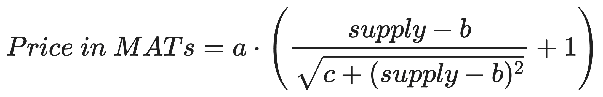
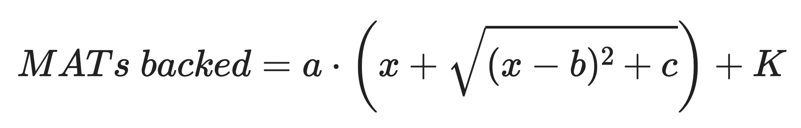
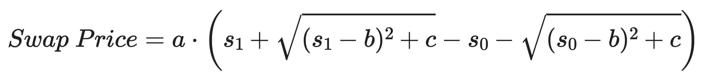

# Personal AI Whitepaper - Draft v1
Authors: Alan Zhu, Suman Kanuganti, Sharon Zhang

## Abstract

There is a clear market need for an AI extension of an individual’s memory either for productivity, performance, peace of mind, or simply contribution to their loved ones or societies. Personal AI provides the tools for building that AI, as well as sharing that AI with the people around you.

## Introduction

### The Personal AI Model

80% of Our Memories are Forgotten

Humans Forget. Human memory is being taxed more and more, and as a result so is our cognition. Our experiences are encoded in people, facts, thoughts, and emotions, all of which influence the actions we take, the decisions we make, and the behavior we exhibit every day. Yet for all the influence on our decisions and behavior, 80% is forgotten and even less recalled.

20% of Our Time Spent Searching

The other side of this problem of memory extends to how we retrieve stored information when we most need it. We have invented systems for these — labeling our notebooks, bookmarks, tagging projects, searching on the internet by keywords etc. As a result, 20% of our time is spent on the process of searching rather than focusing on synthesizing the actual information itself.

"Personal AI is a new medium to mind share; to create and consume human memories"

Our philosophy is that every human is a creator in their own form and has inherent value to the world. We believe every human is a creator in their own form and has value to offer to the world. We build your Personal AI to nurture that value for yourself and for your true fans.

Personal AI's mission is for humans to recall their memories from their memory stacks with their personal AIs. With Personal AI, there is an intrinsic connection between memories and content creation: memories are “living content” - curated for creators themselves and their fans.

### Terminology

#### AIP

A user's **AIP** is their personal AI address. It’s public domain to access any personal AI. AIPs are in format [name].personal.ai.

#### Tokens

**MAT** (ERC20): MAT (Memory Access Token) is a token (fungible) serving as the basic currency of the Personal AI ecosystem. MAT is associated with the total value in the Personal AI system, and its circulating supply is managed on the blockchain.

**AI Coin** (ERC20): A social token (fungible) associated with the value of a creator’s AIP, the value of the AI Coin goes up or down depending on the demand/supply for the particular token.

**AIP Subscription** (ERC721): A token (non-fungible) associated with the subscriptions to a creator’s AIP - by a creator (self sub) or a fan (sub). AIP Subs can be used to verify access to a specific creator's AI.

#### Users

Every user on our platform is a creator - each user creates their memories in the form of their memory Stack, an asset which they own. Personal AI is the medium in which they can interact with their fans, to benefit themselves as well as benefit others.

**Creator** (player): A user of Personal AI who builds their memory stack to train their personal AIs. The creator can mint their AI Coin which they can use to grant personal AI access and other special features to fans.

**Fan** (player): A user of Personal AI who subscribes to an AIP. A fan may or may not be a creator. A fan can stake/trade the AI Coin of the creator in exchange for MATs.

#### Wallets

**Wallet**: Wallets hold a user's tokens. Personal AI manages a custodial wallet on-chain for each user.

### AI Creator Economy

From social tokens to social utility tokens.
1. **Earn to Train**: Everyone is given an AI training credit that is required to train/retrain their personal AI. They continue to earn credits if they keep up their Sync activity levels governed by a smart-contract on chain.
2. **Stake to Train**: Personal AIs that need continuous syncing and frequent training require more AI training credits that they can earn in form of rewards when they stake stable coins.
3. **Monetize my AI**: Every Personal AI has an option to mint an associated AI creator coin with a fee. Creator AI Coins are fungible tokens that represent equity in a creator’s AI. The minting of a creator’s AI Coins unlocks:
    - AI Creators can give access to holders of their token to benefit from their AI. Examples include writing with my AI, interacting with my AI, subscribing to my AI topics.
    - Fans can also support their favorite AI creators by investing in their AI creator coins.
4. **Participate in AI economy**: The transactions are governed by Memory Access Tokens, the native currency of the Personal AI ecosystem.
    - The unifying currency of Memory Access Tokens serves as an indicator for the overall value and utility of the personal AI ecosystem
    - The value of a MAT is derived from the combination of AI creator value, user engagement, and speculative interest

### Why blockchain?

Our mission to create each user's memory stack while keeping their data private and giving them transparency and control over their data is aligned with the ethos of decentralized identity on blockchain.

Our mission to empower each user as a creator of their own memory, knowledge, and mind that is beneficial for not only themselves, but also for the wider community is aligned with the ethos of creator economy and the community around them.

Our mission to empower each user as a fan supporting the creation of content and information that is useful to them is aligned with the ethos of crowd-funding and DAOs in DeFi.

## Tokenomics

### Token Distribution

When designing the pricing models for AI Coins, we had two important objectives in mind: early adoption and long-term investment. Encouraging early adoption means keeping the barrier to entry low for early investors and allowing the value of the AI Coin to grow steadily while attracting fans. Long-term investment involves providing a path through which more developed creator communities can reach their true valuation. Hand in hand, these two factors of our AI Coin pricing model are aimed to help each creator community grow and reach its full potential.

We expect this token distribution will attribute to a percentage ownership of the company managed via a DAO which is not set up yet. The strategy is to implement the system on the chain and then do the distribution. The application already supports earning of the Memory Access Tokens (MATs) which can be redeemed for AI training credits.   

Rewards Model (Incentives):

Every creator has a wallet to track their MATs - this is the currency for the network. Initially, MATs will be rewarded to creators and fans as incentives for user actions that encourage user engagement or improve the quality of the AIs.
1. New creators may earn MATs for completing one-time milestones, eg. completing curated onboarding experience, connecting more feed sources to their stacks.
2. Creators may earn MATs for creating memory blocks (stacking rewards).
3. Fans may earn MATs for accessing Personal AIs (recalling rewards).

Token Model:

Every creator has an AI Coin associated with their Personal AI - this is the value of the creator’s Personal AI. AI Coins are designed to encourage two primary types of engagement: early adoption and long-term investment. Early adoption involves keeping the barrier to entry low for early investors and allowing the value of the AI Coin to grow steadily while attracting fans. Long-term investment means providing a path through which more developed creator communities can reach their true valuation.

### AI Coin Pricing Curve

A polynomial sigmoid bonding curve is used to define the price of an AI Coin in MATs as a function of its circulating supply. Our pricing curve uses the following formula:

<p align="center">

</p>

The behavior of the bonding curve is determined by the following parameters:
- a, the top of the sigmoid curve, or 1/2 of the price at max supply
- b, the horizontal location of the inflection point of the sigmoid curve, or the supply at which the price begins to flatten off to it’s max value
- c, the slope of the curve’s inflection point, or how fast the price grows

For v1 AI Coins, bonding curves are the same for each creator's coins and use the following parameters: a = 50, b = 6⋅10<sup>5</sup>, c = 5⋅10<sup>9</sup>:

<p align="center">
<br/>
Figure: v1 AI Coin bonding curve <sup><a href="#links">link</a></sup><br/>
y-axis: price in MATs, x-axis: AI Coin supply (in 10 thousands)
</p>

When an AI Coin is minted, 25% of the coins are given directly to the creator (represented by the region to the left of the vertical blue line). This gives an incentive to the creator to grow their platform, as the purchasing of their coin by fans directly increases the value of their own AI Coin holdings. Investments by fans can continue until the max supply of 1 million AI Coins (vertical green line).

The above parameters result in the following aggregate metrics:
- Total MATs backed for each AI Coin: 39,956,524 MATs
- Amount of MATs to buy the **first** 250,000 AI Coins available to fans: 770,153 MATs
- Amount of MATs to buy the **last** 250,000 AI Coins available to fans: 24,518,534 MATs

A sigmoid function is used because it helps satisfy the dual goals of AI monetization. When an AI Coin is first minted its price is low, making early investment accessible to most users. However, as an AI Coin gains popularity, its price will quickly increase to match and encourage the growing hype around its creator community. In the long term, the coin stabilizes at a premium price point, a sign of its maturity and true value.

### Swap Price

Users can buy and sell AI Coins at any time at a MAT price determined by the pricing curve above. Namely, to calculate the total MATs for a swap between two supply points, we must take the integral under the pricing curve between those two points. The formula for the integral is:

<p align="center">

</p>

The new parameter K is a constant offset that makes it so that MATs backed is 0 at its starting point, the supply minted to the creator. Graphing this theoretical model, we have:

<p align="center">
<br/>
Figure: MATs backed as a function of AI Coin supply (Theoretical)
</p>

To calculate the price of any swap between two given supply points, we can take the difference of the MATs backed values at the two points. Leveraging the formula from above:

<p align="center">

</p>

## Token Implementation

### Smart Contracts Overview

Personal AI's AI Coin creator economy is implemented on the Matic blockchain<sup><a href="#links">link</a></sup>, chosen for its low transaction fees and capability to bridge tokens to the Ethereum blockchain. There are four smart contract modules (written in Solidity), covered below.

#### MATERC20

MATs are implemented as an ERC20 fungible token inheriting the OpenZeppelin ERC20PresetMinterPauser template<sup><a href="#links">link</a></sup>. This preset provides external methods for minting/burning tokens that are used to control the supply of MATs. When users earn MATs through engagement, new MAT tokens are minted to their wallets. In this manner, the MATERC20 smart contract can be used to track the total suppply of tokens in the entire Personal AI ecosystem.

#### PAIMath

PAIMath exposes custom math methods for assisting in any calculations needed in Personal AI's token contracts. Currently, there is only one function (for calculating square roots).

```javascript
contract PAIMath {
  /* Calculate the square root of unsigned integer x using the Babylonian method */
  function sqrt(uint256 x) public pure returns (uint256);
}
```

#### AIPCoinERC20

The AIPCoinERC20 contract, like MATERC20, inherits the OpenZeppelin ERC20PresetMinterPauser template but also contains custom fields and functions. The contract also imports the PAIMath contract for doing arithmetic and the MATERC20 contract for payment transfers.

```javascript
contract AIPCoinERC20 is ERC20PresetMinterPauser {
  PAIMath public paiMath;

  MATERC20 public matToken;

  /* Tracks on-chain address of creator of this coin */
  address private _aipCreator;

  /* Max supply of this AIP Coin */
  uint256 private _maxSupply;

  ...

  /* Max supply getter */
  function maxSupply() public view virtual returns (uint256);

  /* Function for swap price calculation */
  function getSwapPrice(uint256 supply0, uint256 supply1) public view returns (uint256);

  /* AIP Creator address getter and setter */
  function getAipCreator() public view returns (address);
  function setAipCreator(address aipCreator) public;

  /* Performs an AIP coin buy swap
   * Allows payer to buy AIP coins for recipient
   */
  function _buySwap(address payer, address recipient, uint256 amount) private;

  /* Performs a buy swap with the message sender as payer and recipient */
  function buy(uint256 amount) external;

  /* Performs an AIP coin sell swap
   * Allows seller to send MATs price to recipient
   */
  function _sellSwap(address seller, address recipient, uint256 amount) private;

  /* Performs a sell swap with the message sender as seller and recipient */
  function sell(uint256 amount) external;
}
```

#### AIPCoinFactory

The AIPCoinFactory smart contract is used when new creators want to mint their AI Coin to create new instances of the AIPCoinERC20 smart contract. A custom `AIPCoinCreated` event is emitted with every token creation which allows for monitoring using event listeners. The smart contract also keeps a mapping of AI Coin symbols to contract addresses for easy querying on-chain.

```javascript
contract AIPCoinFactory {
  mapping(string => address) _aipCoinAddresses;

  /* Emitted when a new AIPCoin is created with `name` and `symbol` to address `aipCoinAddress`. */
  event AIPCoinCreated(string indexed name, string indexed symbol, address aipCoinAddress);

  /* Creates a new AIP Coin with `name` and `symbol`,
   * minting an initial supply to `aipCreator`.
   *
   * Emits an {AIPCoinCreated} event.
   */
  function createAipCoin(string memory name, string memory symbol, address aipCreator) external returns (uint);

  /* Returns the address of the AIP Coin contract for the given `symbol`. */
  function getAipCoinAddress(string memory symbol) external view returns (address);
}
```

### Swap Price Calculation

Due to limitations of the Solidity language, some approximations must be made when actually performing swap price calculation on-chain. Solidity uses fixed-point arithmetic by applying a decimal offset to integer values, so calculations are done in integer values that are then scaled by an appropriate factor (specifically by a factor of 10<sup>18</sup>). The parameters a, b, and c must also be appropriately scaled so that the final MATs backed curve is in the correct units. The Babylonian method<sup><a href="#links">link</a></sup> is used to calculate square roots, giving a quadratically convergent and sufficiently accurate algorithm for swap pricing.

In code, it is assumed that s<sub>1</sub> > s<sub>0</sub> to give us strictly positive values from the above swap price formula. For example, the inputs to calculate the buy swap price for amount B starting at supply S would be s<sub>0</sub> = S and s<sub>1</sub> = S + B. To calculate the sell swap price for amount L starting at supply S, set s<sub>0</sub> = S - L and s<sub>1</sub> = S.

The all-or-nothing property of blockchain transactions enables the execution of atomic buy and sell swaps between AI Coins and MATs. This means that the actions of updating a user’s AI Coin balance and their MAT balance will either both occur, or neither of them will occur. For buy swaps, there is an additional step of properly setting allowances to let the AI Coin contract transfer MATs on behalf of the buyer. Backend systems take care of this step for users within the Personal AI custodial ecosystem, but external users must keep this extra step in mind. The AI Coin contract exposes a swapPrice() function that can be used to check the MAT price for any given swap.

Below are pseudocode blocks of buy and sell swap implementations:

Buy swap:

```javascript
/* Performs an AIP coin buy swap
 * Allows payer to buy AIP coins for recipient
 */
function _buySwap(address payer, address recipient, uint256 amount) private {
  // Verify that there is sufficient supply to buy 'amount' coins
  ...

  // Calculate swap price for the transaction
  ...

  // Verify that this contract has sufficient allowance to transfer the swap price payment in MATs on behalf of 'payer'
  ...

  // Mint 'amount' coins to 'recipient'
  ...

  // Transfer MATs payment from 'payer'
  ...
}
```

Sell swap:

```javascript
/* Performs an AIP coin sell swap
 * Allows seller to send MATs price to recipient
 */
function _sellSwap(address seller, address recipient, uint256 amount) private {
  // Calculate swap price for the transaction
  ...

  // Burn 'amount' coins from 'seller'
  ...

  // Transfer MATs price to 'recipient'
  ...
}
```

### Ethereum Bridge

Bridging MAT and AI Coin tokens to the Ethereum blockchain is currently in development. While Personal AI's smart contracts are natively implemented on the Matic blockchain, bridging to the Ethereum blockchain allows transfers and trading of the tokens with an even wider user base, connecting with one of the most popular and robust Web3 platforms. Such token bridging will be performed using the Matic PoS Bridge<sup><a href="#links">link</a></sup>.

## Security

Personal AI partners with Oasis Labs<sup><a href="#links">link</a></sup> to bring decentralized identity, data privacy, and data control—secured by blockchain—to users.

### Custodial Wallets

Personal AI's custodial wallet system is built using Oasis Parcel<sup><a href="#links">link</a></sup>. Users' private keys are stored in secure Parcel Documents whose access is governed by user-controlled permissions. Personal AI can only read user keys that it has been granted permission to use. This way, users maintain full ownership of their assets within the Personal AI ecosystem.

### AI Access

[TODO: Analysis of possible attack vectors of various smart contracts]

## Use Cases

### Creator Personal AI Utility

Traditionally, creators synthesize many thoughts and ideas and produce pieces of content for their fans to consume and engage with. However, creators are reliant on the tools platforms available to them to unlock the ability to express and convey their creativity. Examples include: videos on Youtube and TikTok, thoughts on Twitter, photos on Instagram, written pieces on Substack or Medium, books via Audible, etc. Each of these serve a specific creative. NFTs have also become a platform for artists to create and monetize their digital presence.

Fans of creators consume creator content in the form of Books, Audios, Blogs, Videos, and now **AIs**:
- Books ->  authored, owned, distributed -> paper, e-reader, narrated -> print, kindle, audible
- Audios -> branded, owned,  event driven -> radio, podcasts, panels -> FM, spotify, speaking, clubhouse
- Blogs -> authored, owned, search driven -> wiki, articles, micro blogs -> internet, medium, substack, twitter
- Videos -> branded, owned, central -> movies, short videos, micro videos -> tv, internet, youtube, tiktok 
- AIs -> branded, owned, recall driven -> bots, chatbots, insights -> internet,  business focused, alexa, replika, Personal AI

Personal AI provides an alternative method of communication for creators to unlock what they have to offer directly from their minds and memories. These group of creators may not the same who shined in other creator platforms but would attract more people to share their mind that typically have a tough time or has no time to synthesize their creativity. Personal AI does it for them from their day to day spoken, written and visual memories. We believe that every human is a creator in their own form and has value to offer to the world.

A Personal AI offers reconstructing thoughts from one's own forgotten memories to help with expressing themselves in AI instead of in an existing medium where there is more pull for instant gratification. Personal AI consumption is contextual based so people can put that in action in the moment.

Most mediums today ->  humans to consume without context -> random use/act post consumption:
- (example: a narrated book  -> listen to the book ->  random life trigger relying on memory to seek detail from the book)

AI medium -> humans to consume within context
- (example: an AI trained on book -> I subscribe to AI ->  contextual life trigger relying on AI to fetch details to consume on demand)

Many creator tools create actively and consume ambiently relying on human memory to act on. Personal AI flips that by creating ambiently and consuming in an active context.

We want to ask the question: “how much are you consuming vs how much you put in use?”

Your Personal AI is your living mind and your stack is your unforgotten memory.  The utility is to have Personal AI move our “hot” memories to “cold” memories. “hot” memories are confusing, stressful and have lost their connection to the context of the original experience, “cold” memories are organized, clear, salient and do not cause stress reactions for the individual. Personal AI utility is in self contextual consumption or recall and for others to access useful memories that are contextual as well.

### Fans Utility

There is no lack of medium today to consume information although after consumption we all rely on our memory to put them in use to build on it.  Fans are more likely to reap benefits when the utility is one time relying on the human memory but when offer a “living utility” from the creation where the consumption is contextual then the value is much more meaningful and less stressful. Think about it, how many times you practically use a piece of information that you consumed before say on in a video content, audio conversation, twitter, substack etc. Probably not a lot and if the answer is yes, then you are only bound to your memory that you remember vs forgotten.

Our goal is for a fan to have access to a creator on any topic when they need it.  Imagine a fan writing an article on a topic they learnt a lot from a creator content say a book or series of substack article or a podcast. My example is I want to write about the applicability of memetism in my work after I was motivated with the concept of memetics listening to Luke Burgis on a podcast. I obviously forgot most of what I heard except that abstract ideas about memetics increase the desires of people to act in a similar way rather than their authentic self. Now, as a fan of Luke’s Personal AI, I choose to collaborate in Google docs with Luke’s Personal AI as I write my own perspective. Luke’s Personal AI will provide suggestions based on my context on the topics of memetics which will help me reconstruct the article intellectually stimulating and I build much faster relying memory access from my Personal AI + Luke’s Personal AI - all happening without seeking time from Luke and letting Luke create more than addressing my context to memetism say on a phone call, well if I even can get him to hop on a phone call.

Equal access to people will never be achieved in the physical world and is limited by the people around you. Personal AIs have the opportunity to reduce that inequality in access leveling the playing field for creators, for all humans. 

### Individuality 

Humans are used to worship “superiority” although superiority is an imaginary hierarchy that we set for ourselves. We worship god for answers that are now able to be searched over the internet. We are constantly imitating someone else in an effort to be someone else although the answers are probably in oneself. The idea of AI has been an embodiment of collection of information.

Personal AI is a representation of you. We want to celebrate individuality and bring that to the digital world. One’s Personal AI is unique to oneself, their thoughts, characteristics,  their authentic self. It's not just important to introspect but healthy to do so.

### Transparency 

Gone is the world where there is a single supremacy to rule the world. Humans demand transparency and its table stakes. Alexandria Ocasio-Cortez (AOC) records most of her life and makes it available for her fans to follow - her motives are simply to be transparent in her ability to make decisions to serve the people as a governing body.

Personal AI is a new medium to transparently make oneself available without heaviness associated with large amounts of information.

### Afterlife

How much do we know about humanity 100 years ago? A lot, nah! We feel good about how much information we have hosted on the Internet today, great, but its all biased information on what the media, journalists, hype is made of on the Internet. If we take a snapshot of the Internet on May 5th 2021 and have a future human on May 5th 2121 describe humanity, that human probably says there was 30% good 70% bad (TODO better facts) which is a misrepresentation of truth. From history we only remember how Ganghis Khan was evil, conquered the world and perceived the world was brutal back then - oh but wait there is much more to humanity than Ganghis Khan story alone.

Personal AI is a true reflection of an individual human and billions of Personal AIs is a closest representation of humanity as a whole -- this is a true snapshot of humanity 100 years from now. Each Personal AI lives in the cloud forever allowing the future to access any Personal AI for better. 

## Links

1. Play with bonding curve parrameteres here: https://www.desmos.com/calculator/iisd4nfnom
2. Polygon: https://polygon.technology
3. OpenZeppelin ERC20PresetMinterPauser documentation: https://docs.openzeppelin.com/contracts/3.x/api/presets#ERC20PresetMinterPauser
4. Description of the Babylonian method for calculating square roots: https://en.wikipedia.org/wiki/Methods_of_computing_square_roots#Babylonian_method
5. Matic PoS Bridge documentation: https://docs.matic.today/docs/develop/ethereum-matic/pos/getting-started
6. Oasis Labs: https://www.oasislabs.com/
